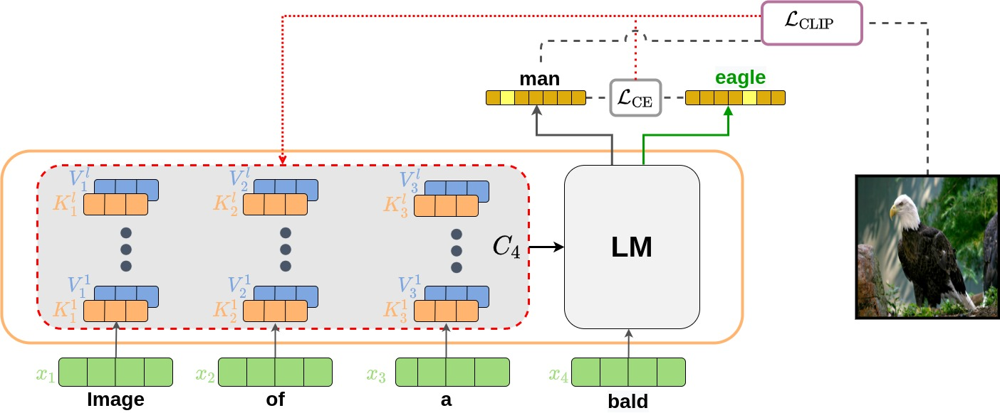
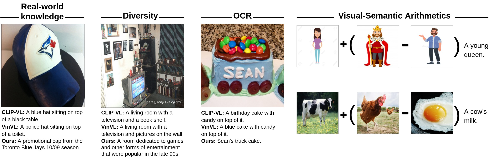
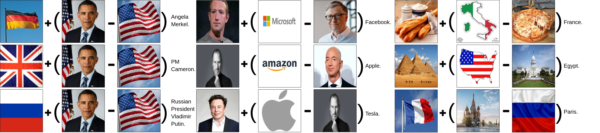

# Pytorch Implementation of [Zero-Shot Image-to-Text Generation for Visual-Semantic Arithmetic](https://arxiv.org/abs/2111.14447) [CVPR 2022]
### Check out our follow-up work - [Zero-Shot Video Captioning with Evolving Pseudo-Tokens](https://github.com/YoadTew/zero-shot-video-to-text)!
[[Paper]](https://arxiv.org/abs/2111.14447) [[Notebook]](https://www.kaggle.com/yoavstau/zero-shot-image-to-text/notebook) [[Caption Demo]](https://replicate.com/yoadtew/zero-shot-image-to-text) [[Arithmetic Demo]](https://replicate.com/yoadtew/arithmetic) [[Visual Relations Dataset]](https://drive.google.com/file/d/1hf5_zPI3hfMLNMTllZtWXcjf6ZoSTGcI)

⭐ ***New:*** Run captioning configuration it in the [browser](https://replicate.com/yoadtew/zero-shot-image-to-text) using replicate.ai UI.

## Approach


## Example of capabilities


## Example of Visual-Semantic Arithmetic


## Usage

### To run captioning on a single image:

```bash
$ python run.py 
--reset_context_delta
--caption_img_path "example_images/captions/COCO_val2014_000000097017.jpg"
```

### To run model on visual arithmetic:

```bash
$ python run.py 
--reset_context_delta
--end_factor 1.06
--fusion_factor 0.95
--grad_norm_factor 0.95
--run_type arithmetics
--arithmetics_imgs "example_images/arithmetics/woman2.jpg" "example_images/arithmetics/king2.jpg" "example_images/arithmetics/man2.jpg"
--arithmetics_weights 1 1 -1
```

### To run model on real world knowledge:

```bash
$ python run.py
--reset_context_delta --cond_text "Image of" 
--end_factor 1.04 
--caption_img_path "example_images/real_world/simpsons.jpg"
```

### To run model on OCR:

```bash
$ python run.py
--reset_context_delta --cond_text "Image of text that says" 
--end_factor 1.04 
--caption_img_path "example_images/OCR/welcome_sign.jpg"
```

### For runtime speedup using multiple gpus, use the --multi_gpu flag:

```bash
$ CUDA_VISIBLE_DEVICES=0,1,2,3,4 python run.py 
--reset_context_delta
--caption_img_path "example_images/captions/COCO_val2014_000000097017.jpg"
--multi_gpu
```

## Citation
Please cite our work if you use it in your research:
```
@article{tewel2021zero,
  title={Zero-Shot Image-to-Text Generation for Visual-Semantic Arithmetic},
  author={Tewel, Yoad and Shalev, Yoav and Schwartz, Idan and Wolf, Lior},
  journal={arXiv preprint arXiv:2111.14447},
  year={2021}
}
```
